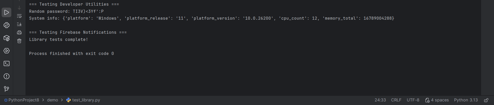

# DevNotifyPy


---

DevNotifyPy is a Python library that provides developer utilities and optional Firebase notification support.


## Installation

Install the library using pip:

```bash
  pip install devnotifypy
```
## Install optional dependencies for Firebase notifications:
``` bash
  pip install firebase-admin psutil
```
### Usage Examples

```python
from devnotifypy import generate_password, system_info, csv_to_json
from devnotifypy import init_firebase, send_notification, random_activity_notification

# ------------------ Developer Utilities ------------------
print("Random password:", generate_password(12))
print("System info:", system_info())

# Optional CSV to JSON
# csv_to_json("data.csv", "data.json")

# ------------------ Firebase Notifications (Optional) ------------------
init_firebase("service_account.json")
token = "YOUR_DEVICE_TOKEN"
send_notification("Hello!", "This is a test notification", token)
random_activity_notification(token)
```
## Features
- Generate random passwords
- Get system information
- Convert CSV files to JSON
- Send Firebase push notifications
- Random activity notifications for social apps
- Useful for testing Firebase integration

## Demo Screenshot





## Requirements

- Python 3.8

- psutil for system info

- firebase-admin for Firebase notifications (optional)

## Use Cases

- Learning Python utilities
- Testing Firebase push notifications
- Building demo applications
- Simulating social media notifications

## ⚠️ Disclaimer
This project is for learning and testing purposes only.
## Author
M Thamarai Priya


## License
MIT License